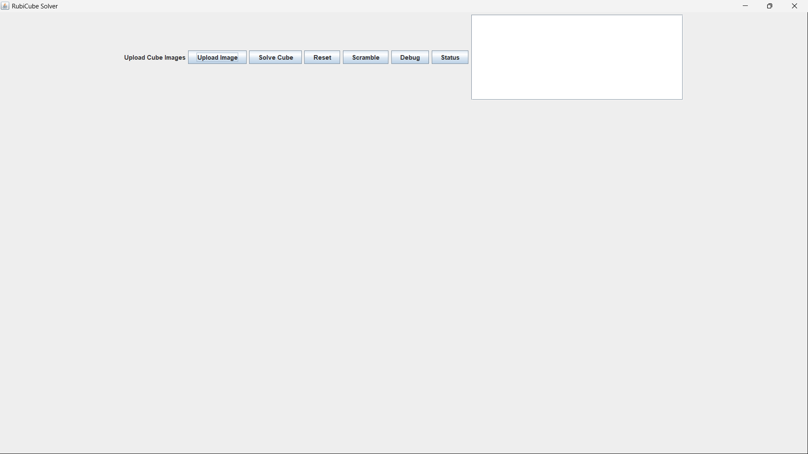

# RubiCube Solver

## Overview

RubiCube Solver is a Java-based application that simulates and solves a Rubik's Cube using Object-Oriented Programming (OOP), Data Structures & Algorithms (DSA), Java Swing, and OpenCV.

The project allows users to upload cube images, detect colors, represent the cube digitally, perform cube rotations, scramble the cube, and generate solution steps through an interactive graphical user interface.

---

## Technologies Used

* Java
* Object-Oriented Programming (OOP)
* Data Structures & Algorithms (DSA)
* Java Swing
* OpenCV
* BFS (Basic Framework)
* Git & GitHub

---

## Features

* Rubik's Cube Representation using 3D Arrays
* Face Rotation Operations
* Cube Scrambling
* Cube State Encoding
* Solution Move Generation
* Image Upload Support
* Color Detection using OpenCV
* Interactive GUI using Swing

---

## Project Structure

RubiCube/

* src/

  * cube/
  * image/
  * solver/
  * ui/
  * utils/
  * Main.java

* images/

* README.md

---

## Future Improvements

* Real BFS Solver
* Advanced Cube Solving Algorithms
* 3D Cube Visualization
* Camera-Based Cube Scanning
* Optimal Move Generation

---

## Author

Sridharshan
## Application Screenshot

